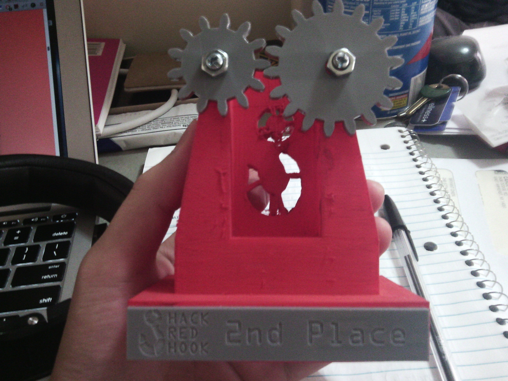

# kiosk +
Hack Red Hook 2016 Hackathon project.
Big Thanks to Lisander, Andrés, and Jeff. 
You guys are what made Hack Red Hook Amazing.
Plus we won 2nd place so WOOTWOOT!!
BEST SQUAD!

# Description
Our project consisted of a physical component and the software component.
The software component is a website where members of the Red Hook Community can 
vote on issues relevant to their community as well as an information kiosk portion (which we hadn't gotten to). 

The Project takes advantage of Twilio API for SMS verification so that 
members of the community can not vote more than once. 

Clone the project at https://github.com/schen2315/kiosk.git
run `node ./bin/www` and go to localhost:3000/
to try it 

Here is an image summarizing the physical component of the project. 
The Kiosk + would sit visibly within Coffey Park for members of the
community to go up to, admire its beauty, and ultimately vote and make a 
difference.
